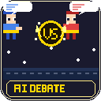

<p align="center">
  
</p>

<h1 align="center">AI Debate Arena</h1>

<p align="center">
  <strong>Watch two AI agents battle it out in a retro RPG-style debate arena — right inside VS Code.</strong>
</p>

<p align="center">
  <a href="https://marketplace.visualstudio.com/items?itemName=STUDIOCOOLKID.ai-debate-arena"></a>
  <a href="https://marketplace.visualstudio.com/items?itemName=STUDIOCOOLKID.ai-debate-arena"></a>
  <a href="https://marketplace.visualstudio.com/items?itemName=STUDIOCOOLKID.ai-debate-arena"></a>
  <a href="LICENSE"></a>
</p>

---

## What is this?

**AI Debate Arena** pits two Claude-powered AI agents against each other to debate any topic you choose. Each agent takes a stance (Pro, Neutral, or Con) and argues its position in real-time — all rendered in a pixel-art RPG battle interface.

> Pick a topic. Choose your fighters. Hit START. Grab some popcorn.

---

## Features

| Feature | Description |
|---------|-------------|
| **Real-time AI Debate** | Two Claude agents argue back and forth automatically |
| **Retro RPG Interface** | Pixel-art characters with sprite animations in a classic battle layout |
| **4 Hero Characters** | Mask Dude, Ninja Frog, Pink Man, Virtual Guy — each with unique sprites |
| **3 Stance Modes** | Set each agent as **Pro**, **Neutral**, or **Con** |
| **Model Selection** | Mix and match **Haiku**, **Sonnet**, or **Opus** per agent |
| **Custom Agent Names** | Name your debaters anything you want |
| **Smart Context** | History summarization keeps long debates fresh and non-repetitive |
| **30+ Languages** | Full UI localization — Korean, Japanese, Chinese, Spanish, French, and more |
| **Auto-save Settings** | Your last configuration is restored automatically |
| **Debate Controls** | Pause, resume, or stop debates at any time |

---

## Quick Start

1. Install [Claude CLI](https://docs.anthropic.com/en/docs/claude-cli) and authenticate (`claude login`)
2. Install this extension from the VS Code Marketplace
3. Open Command Palette → **AI Debate: Start Debate Arena**
4. Enter a topic, pick characters & stances, and hit **START**

---

## How It Works

```
┌─────────────┐     debate topic      ┌─────────────┐
│   Agent A    │ ◄──────────────────► │   Agent B    │
│  (Claude)    │   turn-by-turn       │  (Claude)    │
│  Pro/Con     │   via Claude CLI     │  Pro/Con     │
└─────────────┘                       └─────────────┘
```

Each agent uses **Claude CLI one-shot mode** to generate responses. The extension manages context by:
- **Summarizing older turns** (first sentence only) to save tokens
- **Keeping recent turns in full** for coherent back-and-forth
- **Injecting turn-aware strategy hints** so arguments evolve over time

This means debates stay interesting even after 10+ exchanges.

---

## Requirements

| Requirement | Details |
|-------------|---------|
| **Claude CLI** | [Install guide](https://docs.anthropic.com/en/docs/claude-cli) — must be authenticated |
| **VS Code** | 1.85.0 or later |
| **Anthropic API** | Active API access via Claude CLI |

---

## Extension Commands

| Command | Description |
|---------|-------------|
| `AI Debate: Start Debate Arena` | Open the debate arena panel |
| `AI Debate: Stop Current Debate` | Stop an ongoing debate |

---

## Supported Languages

🌍 English, 한국어, 日本語, 中文, Español, Français, Deutsch, Português, Italiano, Русский, العربية, हिन्दी, Tiếng Việt, ไทย, Bahasa Indonesia, Bahasa Melayu, Filipino, Türkçe, Polski, Nederlands, Svenska, Norsk, Dansk, Suomi, Čeština, Română, Magyar, Ελληνικά, עברית, Українська, فارسی, বাংলা

---

## Tips

- **Use different models** for each agent (e.g., Opus vs Haiku) to see how reasoning depth affects arguments
- **Try unusual topics** — philosophical dilemmas, code architecture debates, or pop culture hot takes work great
- **Switch stances mid-config** — set both agents to "Pro" for an agreement spiral, or both to "Con" for mutual destruction

---

## Made by

**STUDIO COOLKID**

---

## License

[MIT](LICENSE) — do whatever you want with it.
